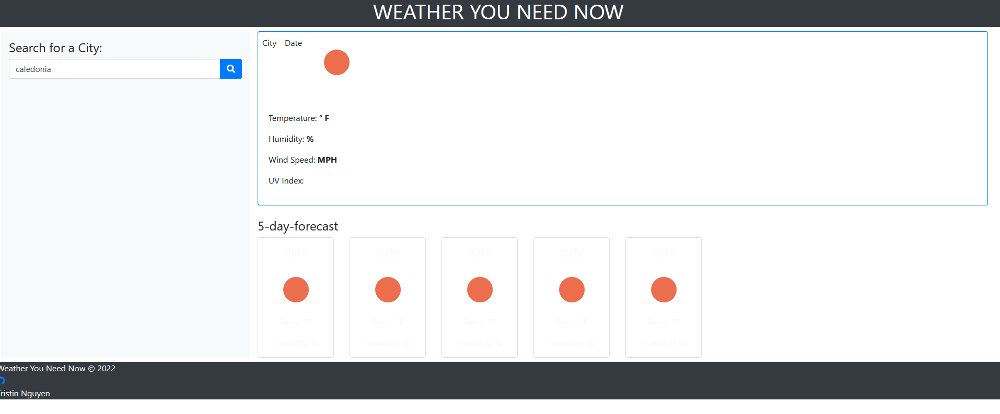

Created via VSCODE

Utilizing javascript and CSS to create a weather app that allows users to search for weather in any city.

Project found on [GitHub](https://github.com/TristinNguyen/Weather-Dashboard)

